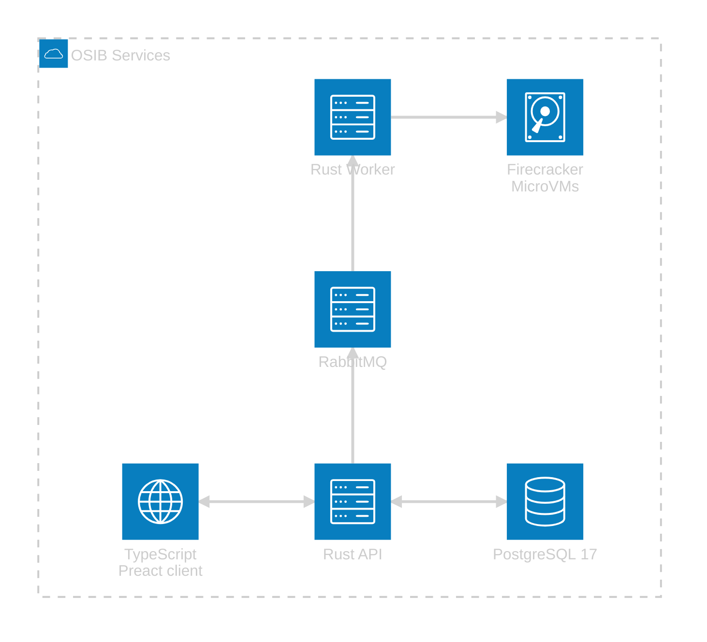

## OSINTBuddy Services

This document provides an overview of the OSIB backend services and how they fit together.


<details open="open">
<summary><b>Table of Contents</b></summary>

- [Overview](#overview)
- [Architecture](#architecture)
- [Services](#services)
- [Quick Start](#quick-start)
- [Message Flow](#message-flow)
- [Artifacts](#artifacts)
- [Links](#links)

</details>


### Overview

This directory contains the Rust service crates that power the OSINTBuddy stack:

- `api`: HTTP+WS API built with actix‑web.
- `worker`: AMQP‑backed worker that launches Firecracker microVMs for sandboxed transform jobs.

See each service README for detailed configuration and usage.

### Status 

> [!CAUTION]
> ⚠️ Experimental (pre‑alpha) ⚠️
>
> Interfaces and behavior may change drastically.


### Architecture Overview



### Docker Services

- **api**: Rust actix-web service exposing `/api/health` and the OSIB application endpoints on port `48997`.
- **worker**: Rust worker consumes AMQP messages from `RabbitMQ`, launches short‑lived Firecracker microVMs to process Python/Node/Bash transform jobs.
- **queue**: RabbitMQ message broker for transforms job dispatch
- **db**: PostgreSQL 17 with primitive event-sourcing built only for the `case entities` models/domain
- **ui**: TypeScript/Preact client (*performs better on Chrome, looks better on Firefox, I personally use Firefox*)


### Quick Start

Use Docker Compose from the root of the repository:

```bash
docker compose up api worker queue db ui
```

Ports _(defaults via `.env`)_:

- Frontend: `55173`
- Backend API: `48997`
  - _(the backend serves the production frontend build if you choose to run `yarn build` in the `frontend/` directory)_
- RabbitMQ: `5672`
- Postgres: `55432 -> 5432`

### Message Flow

Jobs are published to `jobs` (RabbitMQ). The worker consumes, configures a microVM (kernel, rootfs, optional networking/vsock), runs briefly, tears down, then ack/nack. See `worker/README.md` for the JSON schema and environment configuration.

### Artifacts

The worker expects kernel and rootfs images mounted in the container:

- Kernel: `./vmlinux.bin` → `/artifacts/vmlinux.bin`
- Rootfs: `./rootfs.ext4` → `/artifacts/rootfs.ext4`

Optional runtime features:

- KVM: `/dev/kvm` device pass‑through (required for Firecracker).
- TAP networking: `/dev/net/tun` + `--cap-add NET_ADMIN` (if `TAP_NAME` is set).
- Vsock: host directory for Unix sockets (default `/sockets`).

### Links

- [API service](./api/README.md)
- [Worker service](./worker/README.md)
- [firecracker/docs/getting-started.md](https://github.com/firecracker-microvm/firecracker/blob/main/docs/getting-started.md)
- [lapin](https://github.com/amqp-rs/lapin) _(async rabbitmq library)_
- [OSIB README](../README.md)
